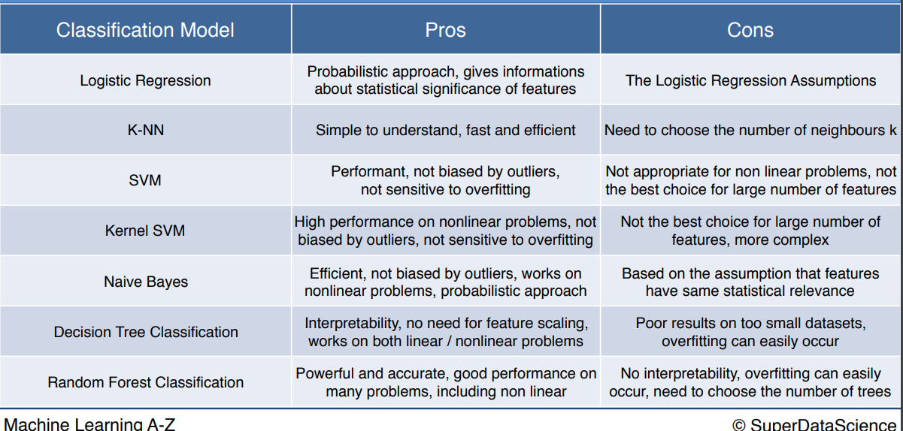
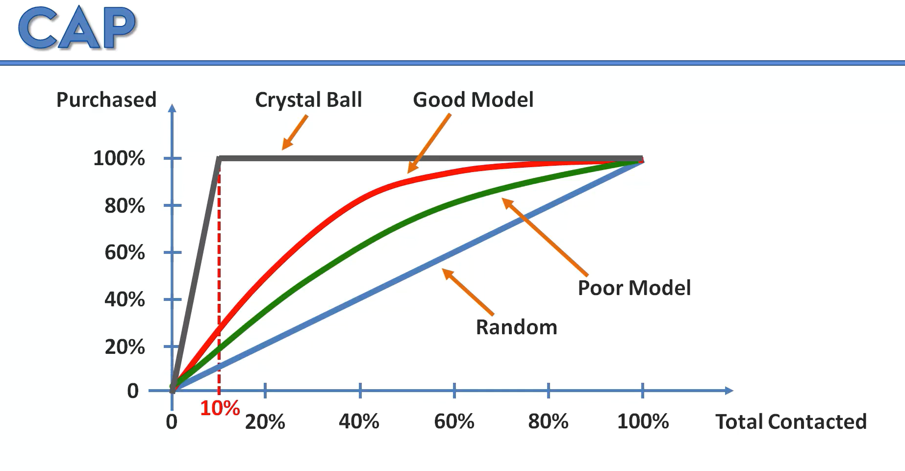

# Regression

## Simple linear regression

[simple linear regression](regression/simple-linear-regression/simple-Linear-Regression.md)

````text
Y = β0 + β1 * X 
````

## Multiple Linear regression

[multiple linear regression](regression/multiple-linear-regression/multiple-linear-regression.md)

````text
yi = β0 + β1 * Xi1 + β2 * Xi2 + ... + βp * Xip + ϵ

where, for i=n observations:
yi = dependent variable
xi = xplanatory variables
β0 = y-intercept (constant term)
βp = slope coefficients for each explanatory variable
ϵ  = the model’s error term (also known as the residuals)
````

## Polynomial Linear regression

[polynomial linear regression](regression/polynomial-linear-regression/polynomial_regression.md)

````text
y = a0 + a1x1 + a2x12 + … + anx1n
````

## Support linear regression

[support linear regression](regression/support-vector-regression/support-vector-regression.md)

## Decision Tree

[decision tree regression](regression/decision-tree/decision-tree.md)

## Random Forest regression

[random forest regression](regression/random-forest-regression/random-forest-intuition.md)

### R-Score

[r-score](regression/check-r_score_regression/r_score.md)

# Classification Algorithms

<p align="center">
  

## Confusion Matrix

## False positive and False negative

## Accuracy Paradox

## Cumulative Accuracy Profile (CAP) Curve

CAP curve is a graphical representation of the number of positive outcomes as a function of the number of samples (or
the percentage of the total number of samples) drawn, and is used to assess the effectiveness of a binary classifier.

<p align="center">
  

## Overfitting and Underfitting


# Clustering Algorithms


# Libraries

Here are some important Machine Learning libraries for **Python**:

1. **NumPy**: It's a library for the Python programming language, adding support for large, multi-dimensional arrays and
   matrices, along with a large collection of high-level mathematical functions to operate on these arrays.

2. **Pandas**: It provides data manipulation and analysis capabilities. It introduces two new data structures to
   Python - Series and DataFrame, both of which are built on top of NumPy.

3. **Matplotlib**: It's a plotting library for creating static, animated, and interactive visualizations in Python.

4. **Scikit-Learn**: It's a free software machine learning library. It features various classification, regression and
   clustering algorithms including support vector machines, random forests, gradient boosting, k-means and DBSCAN, and
   is designed to interoperate with the Python numerical and scientific libraries NumPy and SciPy.

5. **TensorFlow**: It's a free and open-source software library for machine learning and artificial intelligence. It can
   be used across a range of tasks but has a particular focus on training and inference of deep neural networks.

6. **Keras**: It's a user-friendly neural network library written in Python. It is capable of running on top of
   TensorFlow, Microsoft Cognitive Toolkit, Theano, or PlaidML.

7. **PyTorch**: It's an open source machine learning library based on the Torch library, used for applications such as
   computer vision and natural language processing, primarily developed by Facebook's AI Research lab.

8. **Seaborn**: It's a Python data visualization library based on matplotlib. It provides a high-level interface for
   drawing attractive and informative statistical graphics.

9. **SciPy**: It's a free and open-source Python library used for scientific computing and technical computing. It
   contains modules for optimization, linear algebra, integration, interpolation, special functions, FFT, signal and
   image processing, ODE solvers and other tasks common in science and engineering.

10. **Statsmodels**: It's a Python module that provides classes and functions for the estimation of many different
    statistical models, as well as for conducting statistical tests, and statistical data exploration.

Here are some important Machine Learning libraries for **Java**:

1. **Weka**: It's a collection of machine learning algorithms for data mining tasks. The algorithms can either be
   applied directly to a dataset or called from your own Java code.

2. **Deeplearning4j**: It's a deep learning programming library written for Java and the Java virtual machine (JVM) and
   a computing framework with wide support for deep learning algorithms.

3. **ELKI**: It's a framework for developing data mining algorithms in Java. It focuses on unsupervised methods in
   cluster analysis and outlier detection.

4. **MOA (Massive Online Analysis)**: It's a popular open-source framework for data stream mining, with a very active
   growing community. It includes a collection of machine learning algorithms and tools for evaluation.

5. **Java-ML**: It's a Java API with a collection of machine learning algorithms implemented in Java. The aim is to
   provide a clear interface and helpful methods and classes for learning from data.

6. **RapidMiner**: It's a data science platform that provides an integrated environment for data preparation, machine
   learning, deep learning, text mining, and predictive analytics.

7. **Encog**: It's an advanced machine learning framework that supports a variety of advanced algorithms, as well as
   support classes to normalize and process data.

8. **DL4J (Deep Learning for Java)**: It's a distributed deep learning library written for Java and Scala. It's designed
   to be used in business environments, rather than as a research tool.

9. **Smile (Statistical Machine Intelligence and Learning Engine)**: It's a fast and comprehensive machine learning,
   NLP, linear algebra, graph, interpolation, and visualization system in Java and Scala.

10. **Meka**: It's an open-source implementation of methods for multi-label learning and evaluation. It's based on the
    Weka machine learning library.


run jupyter notebook
```bash 
python -m notebook
```